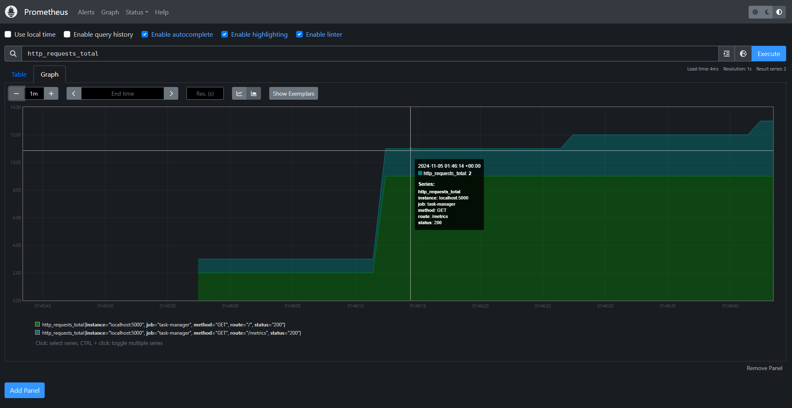
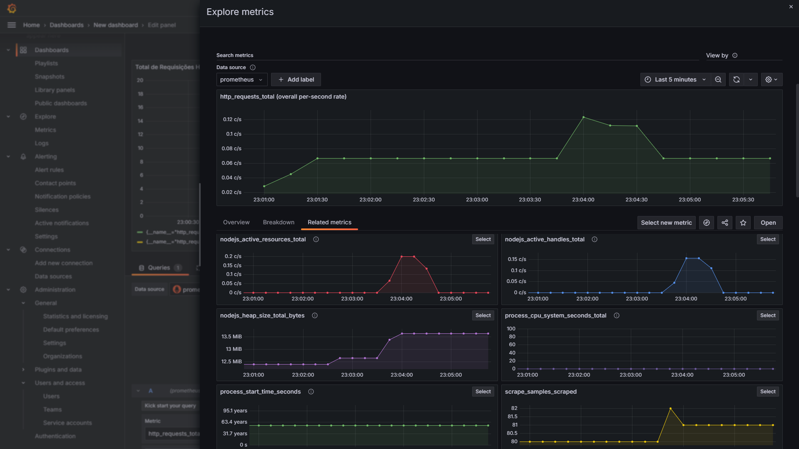

# 📈 Monitoramento de Servidor com Prometheus e Grafana

Este projeto é uma aplicação simples em **JavaScript** que utiliza **Prometheus** e **Grafana** para monitorar o uso do servidor. Com essa aplicação, é possível visualizar gráficos detalhados do desempenho e do uso dos recursos do servidor, ajudando a identificar possíveis problemas e a otimizar o ambiente.

---

## 📸 Pré-visualização

### Dashboard do Grafana

  

### Gráficos de Monitoramento

  

---

## 🛠️ Tecnologias Utilizadas

- **Linguagem**: JavaScript
- **Monitoramento**: Prometheus
- **Visualização**: Grafana

---

## 🔍 Funcionalidades

- **Coleta de Dados com Prometheus**: Armazena métricas sobre o uso do servidor, como CPU, memória e latência.
- **Visualização de Gráficos com Grafana**: Exibe os dados coletados em tempo real com gráficos interativos e personalizáveis.
- **Monitoramento Contínuo**: Permite acompanhar o uso do servidor continuamente para detectar anomalias e melhorar a eficiência.

---

## Objetivo do Projeto

- Aprender a configurar e integrar **Prometheus** e **Grafana** para monitoramento de aplicações.
- Explorar a coleta e visualização de métricas de desempenho do servidor.
- Praticar o uso de ferramentas de monitoramento em uma aplicação JavaScript.

---

📚 *Projeto desenvolvido para entender os conceitos de monitoramento e análise de desempenho com Prometheus e Grafana.*
